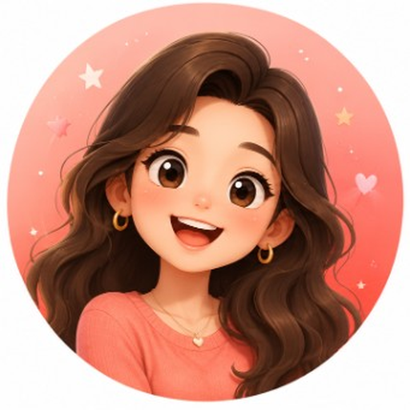

# Callie Design Assets

Phase 0 视觉素材库。HTML 原型与 iOS 实现共用（iOS 导入 Asset Catalog）。

## 目录

```
assets/
├── avatars/         # 伙伴头像 PNG（512×512）
├── brand/           # Logo、App Icon 源文件
├── illustrations/   # onboarding、空状态
└── images/
    └── moments/     # 朋友圈生活类配图 JPG
```

## Icons（内联 SVG）

**不再维护 `assets/icons/` 独立文件。** Tab 栏、导航、朋友圈互动等图标均为设计稿内 **inline SVG**，`stroke="currentColor"`，随主题变色。

| 场景 | 位置 | iOS 对照 |
|------|------|----------|
| Tab 消息 / 学习 / 朋友圈 / 我的 | 各 `screens/*.html` · `tab-bar` | SF Symbols |
| 添加伙伴「+」 | `messages.html` · `nav-icon-btn` | `plus` |
| 点赞 / 评论 / 复习 | `moments.html` · `moment-action` | `heart` / `bubble.left` / `text.book.closed.fill` |
| 通话 / 搜索等 | 对应 screen 内联 | 见 `docs/design.md` §10 |

复制片段可参考 `partials/moment-actions.html`。

## Avatars（3D 角色肖像 · PNG）

Warm Companion 风格 3D 角色头像，512×512，圆形裁切由 CSS `border-radius: 50%` + `object-fit: cover` 呈现。

| 文件 | 伙伴 | 造型 |
|------|------|------|
| `avatar-sarah.png` | Sarah | 珊瑚粉底 · 深棕长卷发 · 大笑 · 金饰 |
| `avatar-alex.png` | Alex | 天蓝底 · 黑色短发 · V 领毛衣 · 温和笑 |
| `avatar-emma.png` | Emma | 薰衣草紫底 · 栗色 bob · 圆框眼镜 · 托腮 |

## Brand Logo

`brand/callie-logo.png` — 1024×1024 App Icon 源文件。暖色渐变底 + 白气泡 + 语音波形 cutout，带柔和投影。

所有设计稿统一使用 PNG 头像；系统消息行仍保留字母 Avatar（`.avatar--system`）。

## 朋友圈配图

| 文件 | 场景 |
|------|------|
| `moment-sarah-park.jpg` | Sarah 周末随拍 |
| `moment-emma-kitchen.jpg` | Emma 烤司康 |
| `moment-alex-flight.jpg` | Alex 出差 |

## HTML 用法

```html


<!-- Tab / 互动图标：inline SVG，见 screens/messages.html -->
<svg class="tab-bar__icon" viewBox="0 0 24 24" fill="none" stroke="currentColor" stroke-width="2" aria-hidden="true">…</svg>
```

## iOS 导入

```
Callie/Assets.xcassets/
├── Avatars/{sarah,alex,emma}.imageset   ← avatar-*.png @1x/@2x/@3x
├── Moments/
└── Brand/AppIcon.appiconset  ← callie-logo.png（1024×1024）
```

图标 **直接用 SF Symbols**，不必入库 SVG。

详见 `docs/design.md` §10。
