# Callie 系统架构图

> 文档版本：v1.4  
> 更新时间：2026-08-23  
> 关联文档：[prd.md](./prd.md) · [project-architecture-and-tech-stack.md](./project-architecture-and-tech-stack.md)

本文档专门描述 **系统架构与核心流程**，以架构图为主。模块职责、技术选型与开发顺序见 [project-architecture-and-tech-stack.md](./project-architecture-and-tech-stack.md)。

---

## 1. 架构总览（Phase 0）

Callie 是 **iOS 原生 App + Cloudflare Workers 自建 Backend + Supabase**，AI 语音由 **腾讯云 TRTC · AI 实时对话** 提供，用户通过 **StoreKit 充值** 获得通话额度。

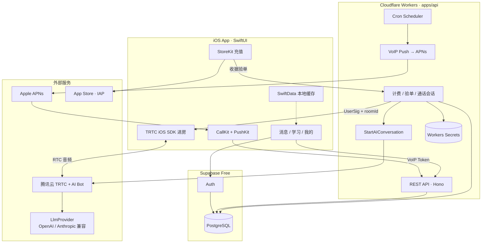

**边界说明：**

| 组件 | 职责 | 不做什么 |
|------|------|----------|
| iOS | UI、CallKit、StoreKit、**TRTC SDK 进房** | 不存 TRTC SecretKey / LLM API Key |
| Workers | API、调度、Push、计费、**签发 UserSig + 启动 AI 对话任务** | 不承载长音频流 |
| Supabase | Auth、持久化数据 | 不做 Scheduler / Push |
| 腾讯云 TRTC | RTC 传输 + **AI Bot 进房** | 不管用户额度 |
| 国内 LLM | 对话推理（经 TRTC LLMConfig + Workers LlmProvider） | Key 仅存 Workers |

---

## 2. 仓库与部署拓扑

代码与文档分离：**Obsidian vault = `docs/`**，代码在仓库根目录。

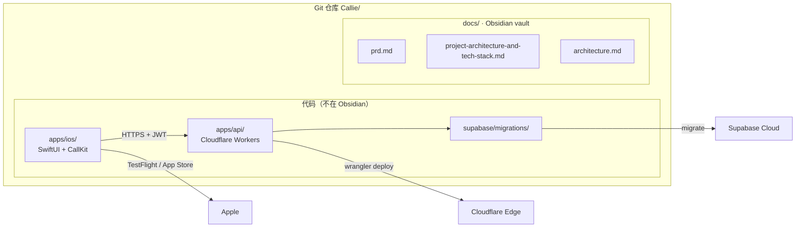

| 路径 | 部署目标 |
|------|----------|
| `apps/ios/` | App Store / TestFlight |
| `apps/api/` | Cloudflare Workers（`wrangler deploy`） |
| `supabase/migrations/` | Supabase PostgreSQL |

---

## 3. 产品核心闭环

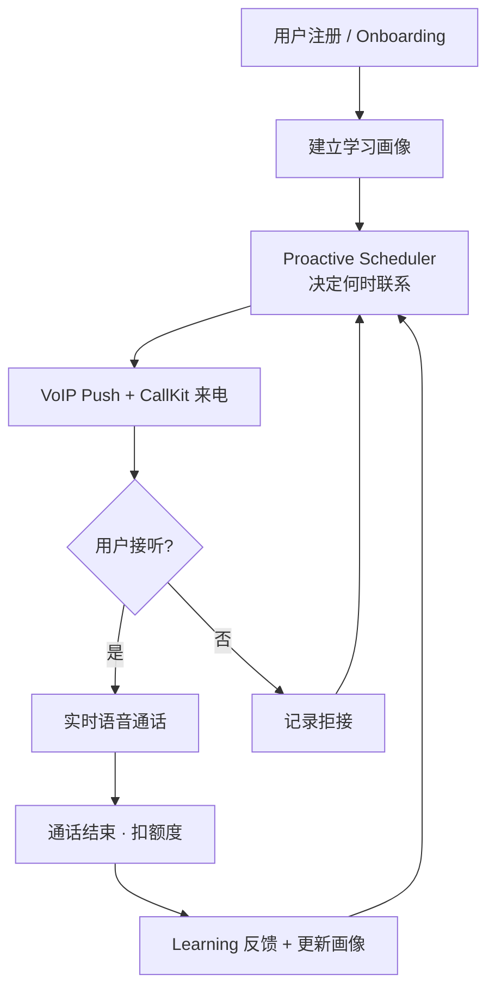

---

## 4. 主动来电流程（卖点）

从 Scheduler 到 CallKit 系统来电界面。

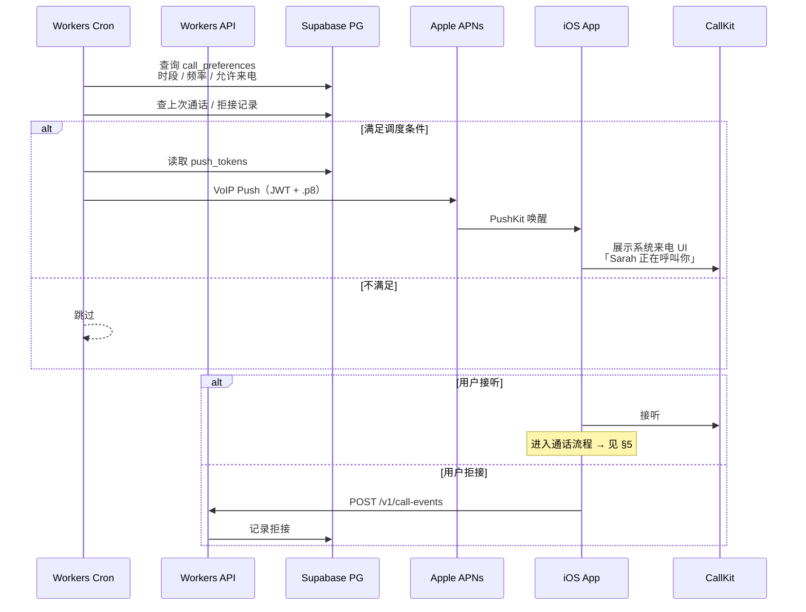

---

## 5. 语音通话流程（TRTC AI 实时对话）

Phase 0：Workers 校验余额 → 签发 **UserSig** → 调用 **StartAIConversation** 让 AI Bot 进房；音频走 **TRTC RTC**，不经 Workers 转发。

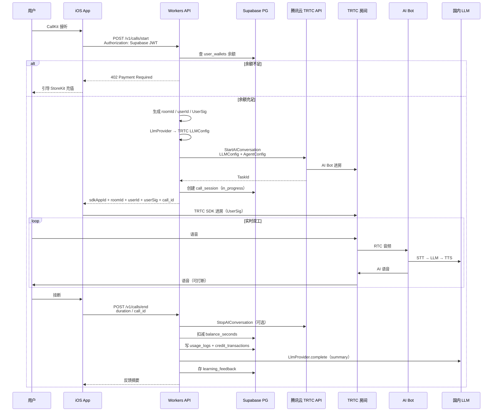

---

## 6. 充值与计费流程

用户通过 **StoreKit IAP** 购买通话额度；Workers 向 Apple 验单后入账。

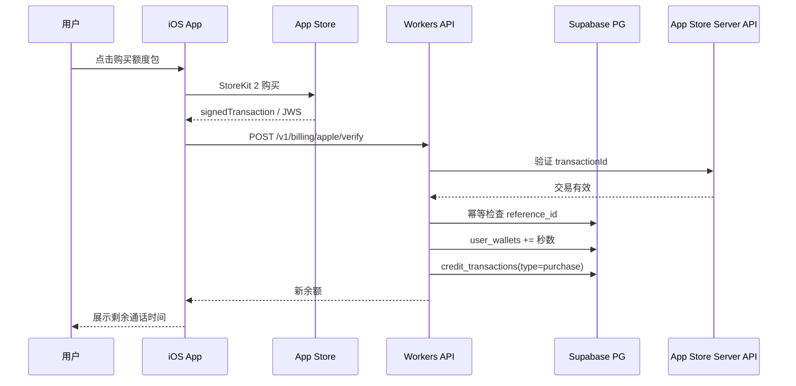

**计费规则（Phase 0）：**

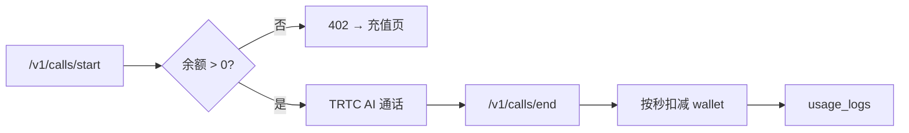

---

## 7. 逻辑模块划分

12 个逻辑模块在 Phase 0 的 **部署归属**（非 12 个微服务）。

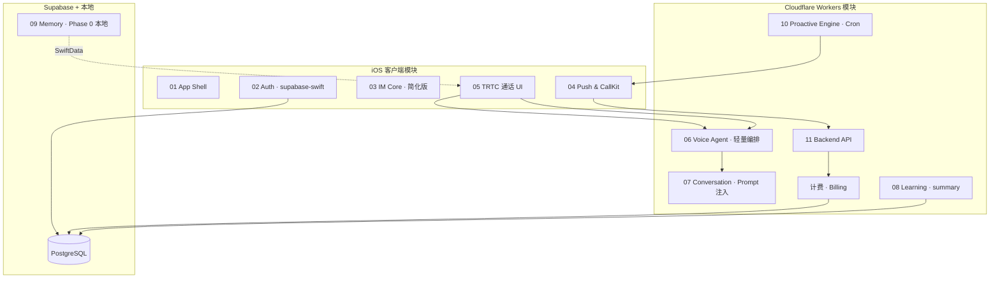

| 模块 | Phase 0 实现位置 |
|------|------------------|
| 04 Push & CallKit | iOS 原生 + Workers → APNs |
| 06 Voice Agent | Workers LlmProvider + StartAIConversation |
| 10 Proactive Engine | Workers Cron |
| 11 Backend | Workers Hono API |
| 计费 | Workers + Supabase `user_wallets` |
| 09 Memory | SwiftData（本地）+ 通话记录上云 |

---

## 8. 数据架构（Phase 0 核心表）

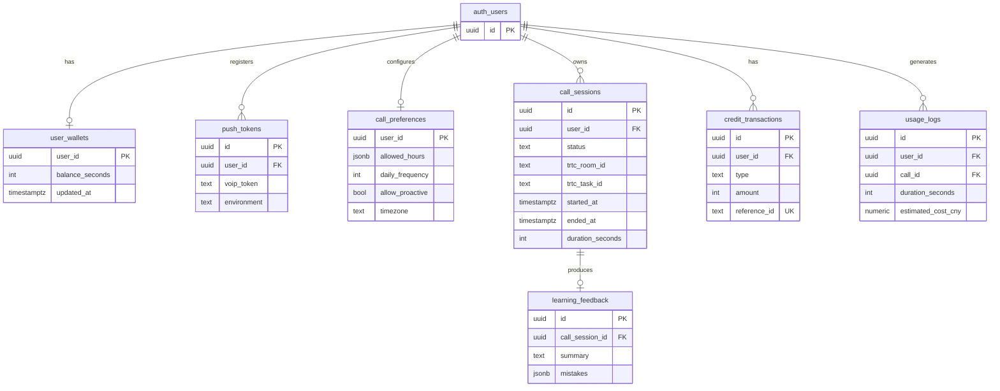

> `auth_users` 由 Supabase Auth 管理；业务表通过 `user_id` 关联。

---

## 9. 安全与信任边界

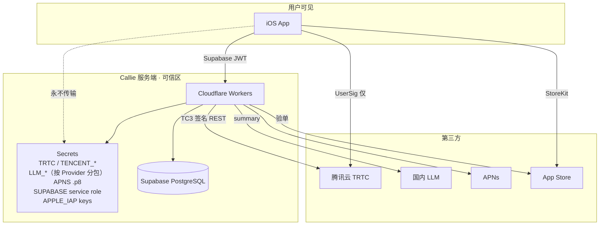

| 数据 | 存放位置 | 是否下发客户端 |
|------|----------|----------------|
| TRTC SecretKey | Workers Secrets | ❌ 永不下发 |
| UserSig | Workers 生成 | ✅ 短时效、单次会话 |
| LLM API Key / Token | Workers Secrets（按 Provider） | ❌ 永不下发 |
| Supabase JWT | iOS Keychain | ✅ 用户会话 |
| 通话额度 | Supabase `user_wallets` | ✅ 仅余额数字 |
| 用户 API Key | — | ❌ 不使用 BYOK |

---

## 10. Supabase ↔ Cloudflare 分工

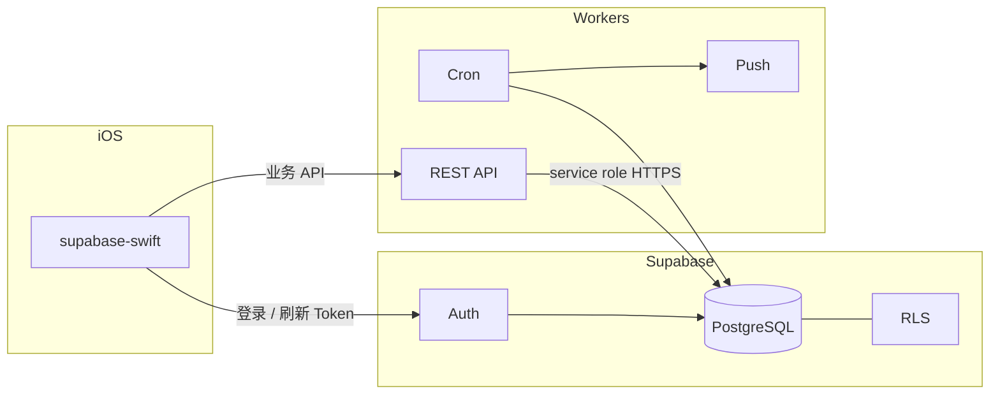

| 能力 | Supabase | Cloudflare Workers |
|------|----------|-------------------|
| 用户登录 | ✅ Auth | 验证 JWT |
| 业务数据 | ✅ PostgreSQL | 读写 API |
| 主动调度 | ❌ | ✅ Cron |
| VoIP Push | ❌ | ✅ → APNs |
| 签发 UserSig + 启动 AI 对话 | ❌ | ✅ |
| StoreKit 验单 | ❌ | ✅ |
| 实时语音流 | ❌ | ❌（iOS ↔ TRTC 云） |

---

## 11. Phase 0 → Phase 1+ 演进

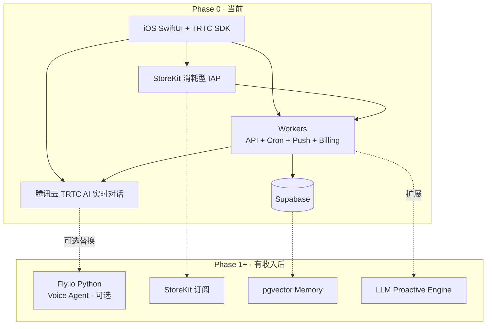

---

## 12. API 路由一览（Workers）

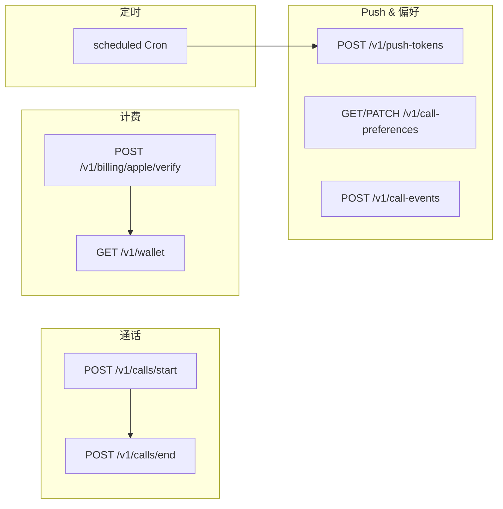

---

## 13. 图例与阅读顺序

建议按以下顺序阅读本文档：

1. **§1 架构总览** — 建立全局印象  
2. **§4 主动来电** — 理解核心卖点  
3. **§5 语音通话** — 理解 TRTC AI 进房与 Workers 编排  
4. **§6 充值计费** — 理解商业化闭环  
5. **§9 安全边界** — 理解 Key 与 Token 分工  
6. **§11 演进** — 理解 Phase 1+ 扩展方向  
7. **§14 TRTC 选型** — 国内支付、Secrets、API 响应形状  
8. **§15 LLM Provider** — 多形态 LLM 适配与 TRTC 对接  

---

## 14. 腾讯云 TRTC · AI 实时对话（Phase 0 选型）

### 为什么选 TRTC

| 维度 | 说明 |
|------|------|
| **支付** | 腾讯云控制台支持 **支付宝 / 国内银行卡**，无需境外信用卡 |
| **免费额度** | 每月约 **10,000 分钟** 免费包（含 AI 对话抵扣，以官网为准） |
| **iOS 集成** | 官方 **TRTC iOS SDK**，与 CallKit / AVAudioSession 成熟配合 |
| **架构** | AI Bot **服务端进房**，iOS 只持 UserSig，不暴露 SecretKey |

### 与 OpenAI Realtime 的差异

| 项 | OpenAI Realtime | TRTC AI 实时对话 |
|----|-----------------|------------------|
| 连接方式 | WebRTC 直连 OpenAI | TRTC SDK 进房 + 云端 AI Bot |
| Workers 职责 | 签发 ephemeral token | 签发 **UserSig** + **StartAIConversation** |
| LLM | OpenAI 内置 | **LlmProvider** → TRTC `LLMConfig`（OpenAI 协议） |
| 计费主体 | OpenAI API | 腾讯云 TRTC + 各 LLM Provider 分别计费 |

### Workers Secrets（Phase 0）

按 **LlmProvider** 分包，不设单一 `LLM_API_URL` 假设。示例：

```text
# TRTC
TRTC_SDK_APP_ID
TRTC_SECRET_KEY
TENCENT_SECRET_ID
TENCENT_SECRET_KEY

# 默认 Provider：openai_compatible | anthropic_compatible
LLM_PROVIDER_DEFAULT=openai_compatible

# OpenAI 兼容（Chat Completions 协议）
LLM_OPENAI_COMPAT_API_KEY
LLM_OPENAI_COMPAT_API_URL      # 如 https://api.deepseek.com/v1/chat/completions
LLM_OPENAI_COMPAT_MODEL

# Anthropic 兼容（Messages API 协议）
LLM_ANTHROPIC_API_KEY
LLM_ANTHROPIC_MODEL            # 如 claude-sonnet-4-20250514

APNS_* / SUPABASE_* / APPLE_IAP_*
```

> 具体 Key 名由 `apps/api/src/lib/llm/` 各 Adapter 定义；新增 Provider 只加 Adapter + Secrets，不改 iOS。

### `/v1/calls/start` 响应形状（示例）

```json
{
  "data": {
    "call_id": "uuid",
    "trtc": {
      "sdk_app_id": 1400000000,
      "room_id": "call_uuid",
      "user_id": "user_xxx",
      "user_sig": "eJyrVgrx..."
    }
  }
}
```

iOS 使用 `sdk_app_id` + `user_sig` 调用 TRTC SDK 进房；Workers 已通过 `StartAIConversation` 让 AI Bot 进入同一 `room_id`。

### 开发成本提示

- 开发期可利用 **10k 分钟/月免费包** + 腾讯云新用户代金券
- LLM 费用单独计（按所选 Provider 向各厂商充值，如 DeepSeek / 百炼 / 火山等）
- 内测仍建议设单用户日上限，防止 TRTC + LLM 账单失控

---

## 15. LLM Provider 抽象（OpenAI / Anthropic 两种兼容）

业界 LLM HTTP API **两种最常见形态**：

| 协议 | 代表厂商 | Callie Provider id | 典型端点 |
|------|----------|-------------------|----------|
| **OpenAI Chat Completions** | OpenAI、DeepSeek、MiniMax、混元、Groq、多数国内网关 | `openai_compatible` | `POST …/chat/completions` |
| **Anthropic Messages** | Anthropic Claude | `anthropic_compatible` | `POST …/v1/messages` |

Workers 内统一 **`LlmProvider` 适配层**，iOS **永远不知道**具体厂商；DeepSeek / 百炼等只是挂在 `openai_compatible` 后面的 **不同 APIUrl + Model**，不是第三套架构。

### 两条 LLM 调用路径

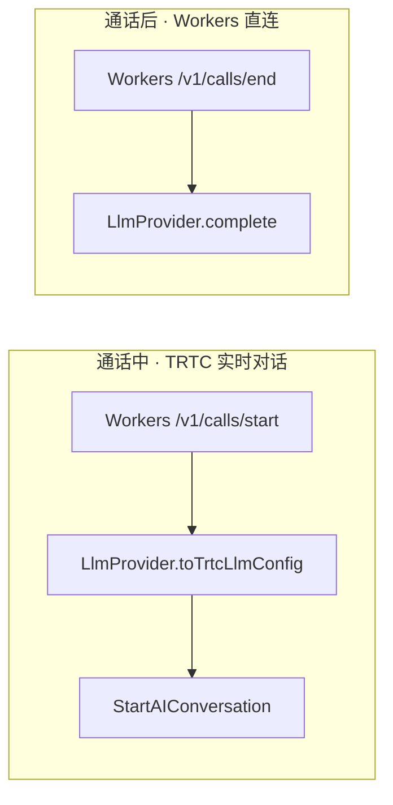

| 路径 | 谁调 LLM | 两种兼容如何接入 |
|------|----------|------------------|
| **通话中** | TRTC AI 任务 | TRTC 原生支持 **`LLMType: openai`**（OpenAI 协议）。`anthropic_compatible` 实时通话需 **OpenAI 兼容网关转 Claude**，或 Phase 1+ 自托管 Agent 直连 Anthropic |
| **通话后** | Workers 直接 | **`openai_compatible` 与 `anthropic_compatible` 均为一等公民**，各自 `complete()` |

两条路径可 **分离 Provider**（例：通话 `openai_compatible` + DeepSeek，总结 `anthropic_compatible` + Claude）。

### Phase 0 推荐默认

```text
LLM_PROVIDER_DEFAULT=openai_compatible     # TRTC 实时对话（TRTC 要求 OpenAI 协议）
LLM_SUMMARY_PROVIDER=anthropic_compatible  # 通话后 summary（可选，质量更好）
```

### TRTC 实时通话与 Anthropic 的说明

TRTC `StartAIConversation` 的 `LLMConfig` 对「标准大模型」走 **`LLMType: openai`**（即 OpenAI Chat Completions 协议）。因此：

- **OpenAI / DeepSeek / 混元等** → 直接填 `APIUrl` + `Model` + `APIKey`  
- **Anthropic Claude 实时通话** → Phase 0 可选：经 **OpenAI 兼容代理**（如 LiteLLM / 自建网关）再交给 TRTC；或 Phase 1+ 自托管 Voice Agent 原生调 Messages API  

通话后的 summary / 学习分析 **不受 TRTC 限制**，可直接用 `anthropic_compatible`。

### Workers 代码结构（规划）

```text
apps/api/src/lib/llm/
├── types.ts
├── registry.ts
├── trtc-config.ts
└── providers/
    ├── openai-compatible.ts    # TRTC 实时 + summary（DeepSeek 等）
    └── anthropic-compatible.ts # summary；P1+ 实时 Agent
```

### `LlmProvider` 接口（概念）

```typescript
type LlmProviderId = "openai_compatible" | "anthropic_compatible";

interface LlmProvider {
  id: LlmProviderId;
  complete(input: LlmCompleteInput): Promise<LlmCompleteOutput>;
  /** openai_compatible → TRTC LLMType "openai"；anthropic 需网关或返回不可用 */
  toTrtcLlmConfig(ctx: CallPersonaContext): string;
}
```

### 设计原则

- **两种协议为主**：OpenAI Chat Completions + Anthropic Messages，覆盖绝大多数模型  
- **厂商是配置，不是架构**：换 DeepSeek → 只改 `APIUrl` / `Model`，不换 Adapter  
- **iOS 零感知**：只拿 TRTC 进房参数  
- **通话 / 总结可拆 Provider**：实时便宜、离线质量高  
- **Anthropic 实时**：文档诚实标注 TRTC 限制与 Phase 1+ 路径

---

## 16. 变更记录

| 版本 | 日期 | 说明 |
|------|------|------|
| v1.4 | 2026-08-23 | §15 移除 Dify/Coze/LKE 等非 Phase 0 内容 |
| v1.3 | 2026-08-23 | §15 明确以 OpenAI / Anthropic 两种兼容为主轴 |
| v1.2 | 2026-08-23 | 新增 §15 LlmProvider 抽象 |
| v1.1 | 2026-08-23 | Phase 0 语音方案改为腾讯云 TRTC · AI 实时对话 |
| v1.0 | 2026-08-23 | 初版：Phase 0 架构图独立成文 |
